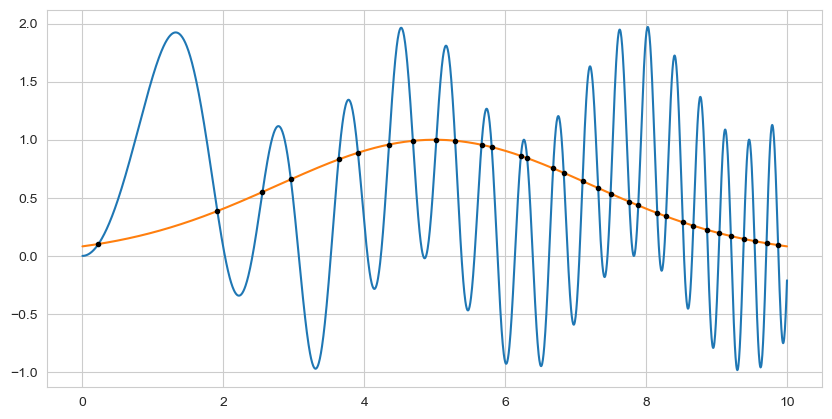

<div align="center">

# ChebPy

### A Python implementation of Chebfun

[](LICENSE.rst)
[](https://www.python.org/)
[](https://pypi.org/project/chebfun/)


[](https://github.com/astral-sh/ruff)
[](https://github.com/astral-sh/uv)
[](https://github.com/pypa/hatch)
[](https://www.codefactor.io/repository/github/chebpy/chebpy)

[](https://github.com/chebpy/chebpy/actions/workflows/rhiza_ci.yml)
[](https://github.com/chebpy/chebpy/actions/workflows/rhiza_marimo.yml)
[](https://github.com/chebpy/chebpy/actions/workflows/rhiza_devcontainer.yml)

[](https://codespaces.new/chebpy/chebpy)

**🔬 Numerical computing with Chebyshev series approximations**

Symbolic-numeric computation with functions

</div>

ChebPy is a Python implementation of [Chebfun](http://www.chebfun.org/), bringing the power of Chebyshev polynomial approximations to Python. It allows you to work with functions as first-class objects, performing operations like differentiation, integration, and root-finding with machine precision accuracy.
---

## Table of Contents

- [✨ Features](#-features)
- [📥 Installation](#-installation)
- [🛠️ Development](#️-development)
- [🚀 Quick Start](#-quick-start)
- [📖 Documentation](#-documentation)
- [📄 License](#-license)
- [👥 Contributing](#-contributing)

---

## ✨ Features

> **Work with functions as easily as numbers**

- 🔢 **Function Approximation**: Automatic Chebyshev polynomial approximation of smooth functions
- 🌊 **Periodic Functions**: Fourier-based approximation via `trigfun` for smooth periodic functions
- ♾️ **Infinite Intervals**: Functions on $[a, \infty)$, $(-\infty, b]$ or the full real line via `CompactFun`
- 📍 **Endpoint Singularities**: Resolve $\sqrt{x}$, $\sqrt{x(1-x)}$ and similar branch-type endpoints to spectral accuracy
- 📐 **Calculus Operations**: Differentiation, integration, and root-finding with machine precision
- 📊 **Plotting**: Beautiful function visualizations with matplotlib integration
- 🧮 **Arithmetic**: Add, subtract, multiply, and compose functions naturally
- 🎯 **Adaptive**: Automatically determines optimal polynomial degree for given tolerance
- 🔁 **Convolution**: Convolve two Chebfuns to produce a new function
- 📏 **Quasimatrices**: Continuous linear algebra via QR, SVD, and least-squares
- 🎲 **Gaussian Process Regression**: GP posteriors returned as Chebfun objects
- 🔗 **Interoperability**: Works seamlessly with NumPy and SciPy ecosystems

---

## 📥 Installation

### Using pip (recommended)

```bash
pip install chebpy
```

### From source (development)

```bash
git clone https://github.com/chebpy/chebpy.git
cd chebpy
pip install -e .
```

> **Note**: Use `-e` flag for editable installation during development

## 🛠️ Development

> **For contributors and advanced users**

ChebPy uses modern Python development tools for a smooth developer experience:

```bash
# 📦 Install development dependencies
make install

# 🧪 Run tests with coverage
make test

# ✨ Format and lint code
make fmt
make lint

# 📓 Start interactive notebooks
make marimo

# 🔍 View test coverage report
make coverage
```

### Development Tools

- **Testing**: pytest with coverage reporting
- **Formatting**: ruff for code formatting and linting
- **Notebooks**: marimo for interactive development
- **Task Management**: Taskfile for build automation

## Quick Start

<div align="center">
  
</div>


This figure was generated with the following simple ChebPy code:

```python
import numpy as np
from chebpy import chebfun

# Create functions as chebfuns on interval [0, 10]
f = chebfun(lambda x: np.sin(x**2) + np.sin(x)**2, [0, 10])
g = chebfun(lambda x: np.exp(-(x-5)**2/10), [0, 10])

# Find intersection points
roots = (f - g).roots()

# Plot both functions and mark intersections
ax = f.plot(label='f(x) = sin(x²) + sin²(x)')
g.plot(ax=ax, label='g(x) = exp(-(x-5)²/10)')
ax.plot(roots, f(roots), 'ro', markersize=8, label='Intersections')
ax.legend()
ax.grid(True, alpha=0.3)
```

### More Examples

```python
# Differentiation and integration
f = chebfun(lambda x: np.exp(x) * np.sin(x), [-1, 1])
df_dx = f.diff()          # Derivative
integral = f.sum()        # Definite integral

# Root finding
g = chebfun(lambda x: x**3 - 2*x - 5, [-3, 3])
roots = g.roots()         # All roots in the domain
```

### Convolution

Convolve two functions to produce a new Chebfun on the summed domain:

```python
from chebpy import chebfun
import numpy as np

f = chebfun(lambda x: np.exp(-x**2), [-1, 1])
g = chebfun(lambda x: np.where(np.abs(x) < 0.5, 1.0, 0.0), [-1, 1])

h = f.conv(g)        # h(x) = ∫ f(t) g(x−t) dt, a Chebfun on [−2, 2]
h.plot()
```

### Quasimatrices

Stack functions as columns of an ∞×n matrix and use continuous
linear algebra — QR, SVD, least-squares:

```python
from chebpy import Quasimatrix, chebfun

x = chebfun("x")
A = Quasimatrix([1, x, x**2, x**3, x**4, x**5])

Q, R = A.qr()             # QR factorisation → Legendre polynomials
U, S, V = A.svd()         # Singular value decomposition

f = chebfun(lambda t: np.exp(t) * np.sin(6 * t), [-1, 1])
c = A.solve(f)            # Least-squares polynomial fit
f_approx = A @ c          # Reconstruct as a Chebfun
```

### Gaussian Process Regression

Fit a GP to scattered data and get the posterior mean and variance
back as Chebfuns — ready for differentiation, integration, and root-finding:

```python
from chebpy import gpr
import numpy as np

rng = np.random.default_rng(1)
x_obs = np.sort(-2 + 4 * rng.random(10))
y_obs = np.sin(np.exp(x_obs))

f_mean, f_var = gpr(x_obs, y_obs, domain=[-2, 2])

f_mean.plot()                     # Posterior mean (a Chebfun)
extrema = f_mean.diff().roots()   # Local extrema via calculus
integral = f_mean.sum()           # Definite integral
```

### Periodic Functions

Use `trigfun` for smooth periodic functions — the same API as `chebfun`,
but backed by a Fourier (Trigtech) representation that is far more compact
for periodic targets:

```python
from chebpy import trigfun
import numpy as np

f = trigfun(lambda x: np.exp(np.sin(np.pi * x)), [-1, 1])
len(f)            # number of Fourier modes
f.diff()          # spectral differentiation in Fourier space
f.sum()           # ≈ 2 · I₀(1)
```

The `gpr` interface accepts `trig=True` for a periodic GP posterior,
also returned as a Trigtech-backed Chebfun.

### Infinite Intervals

Pass `np.inf` or `-np.inf` as a domain endpoint to construct a Chebfun
on a (semi-)infinite interval. Pieces with infinite endpoints are
automatically built as `CompactFun` objects: a Chebyshev expansion on
the discovered numerical-support window, with optional non-zero tail
constants (`tail_left`, `tail_right`) recovered automatically for
sigmoid-like inputs (`tanh`, logistic, …).

```python
from chebpy import chebfun
import numpy as np

# Doubly-infinite Gaussian — sum is √π
h = chebfun(lambda x: np.exp(-x**2), [-np.inf, np.inf])
h.sum()                           # ≈ √π

# Sigmoid-like: tail constants are detected automatically
t = chebfun(np.tanh, [-np.inf, np.inf])
t.funs[0].tail_left, t.funs[0].tail_right    # (-1.0, 1.0)
t(1e10)                                       # 1.0

# Mixed: finite breakpoints with infinite endpoints
p = chebfun(lambda x: np.exp(-x**2), [-np.inf, -2.0, 0.0, 3.0, np.inf])
[type(piece).__name__ for piece in p.funs]
# ['CompactFun', 'Bndfun', 'Bndfun', 'CompactFun']
```

### Endpoint Singularities

Functions with branch-type singularities at one or both endpoints — such
as $\sqrt{x}$ on $[0, 1]$ — cannot be resolved by ordinary Chebyshev
interpolation. Pass `sing="left"`, `"right"`, or `"both"` to switch the
boundary pieces to `Singfun`, which uses an exponential clustering map
to recover spectral accuracy:

```python
from chebpy import chebfun
import numpy as np

# Plain Bndfun fails to converge for sqrt; Singfun resolves it to machine
# precision in ~150 coefficients.
f = chebfun(np.sqrt, [0.0, 1.0], sing="left")
f.sum()                       # 2/3, to machine precision

# Two-sided singularity on the same domain
g = chebfun(lambda x: np.sqrt(x * (1 - x)), [0.0, 1.0], sing="both")
g.sum()                       # pi/8, to machine precision
```

Mixed-piece arithmetic (`Singfun + Bndfun`, etc.) is preserved, and
`restrict` automatically falls back to `Bndfun` on subintervals that
exclude the clustered endpoint. `conv` and `diff` on `Singfun` pieces
are not yet supported.

---

## Documentation

- 🚀 **[Codespaces](https://codespaces.new/chebpy/chebpy)**: Try ChebPy in your browser
- 📚 **[Documentation](https://chebpy.github.io/chebpy)**: Full documentation, user guide, and API reference

---

## 📄 License

ChebPy is licensed under the **3-Clause BSD License**.

📜 See the full license in the [LICENSE.rst](LICENSE.rst) file.

---

## 👥 Contributing

**We welcome contributions!** 🎉

Whether you're fixing bugs, adding features, or improving documentation, your help makes ChebPy better for everyone.

### Quick Start for Contributors

1. 🍴 **Fork** the repository
2. 🌿 **Create** your feature branch
   ```bash
   git checkout -b feature/amazing-feature
   ```
3. ✨ **Make** your changes and add tests
4. 🧪 **Test** your changes
   ```bash
   make test
   ```
5. 📝 **Commit** your changes
   ```bash
   git commit -m 'Add amazing feature'
   ```
6. 🚀 **Push** to your branch
   ```bash
   git push origin feature/amazing-feature
   ```
7. 🎯 **Open** a Pull Request

### Resources

- 📋 [Contributing Guide](CONTRIBUTING.md)
- 🤝 [Code of Conduct](CODE_OF_CONDUCT.md)
- 🐛 [Issue Tracker](https://github.com/chebpy/chebpy/issues)

### Acknowledgments 🙏

ChebPy stands on the shoulders of the **Chebfun project** led by
[Nick Trefethen](https://people.maths.ox.ac.uk/trefethen/) and the Chebfun
development team at the University of Oxford. The mathematical design,
algorithmic ideas, and naming conventions in this library are direct
adaptations of their work — most notably:

- The original [MATLAB Chebfun](https://www.chebfun.org/) system
  ([github.com/chebfun/chebfun](https://github.com/chebfun/chebfun)).
- L. N. Trefethen, *Approximation Theory and Approximation Practice*,
  SIAM, 2013 (extended edition 2019).
- T. A. Driscoll, N. Hale, and L. N. Trefethen (eds.),
  [*Chebfun Guide*](https://www.chebfun.org/docs/guide/), Pafnuty
  Publications, 2014.

We are grateful for their decades of open scholarship, which made this
Python port possible. Any errors in translation or adaptation are ours
alone.

📜 See the [History of the Chebfun Project](https://chebpy.github.io/chebpy/history/)
page for a fuller timeline, key contributors, and foundational
publications.

Project tooling:

- [Jebel-Quant/rhiza](https://github.com/Jebel-Quant/rhiza) for standardised CI/CD templates and project tooling


---

<div align="center">

⭐ *If you find ChebPy useful, please consider giving it a star!* ⭐

</div>
