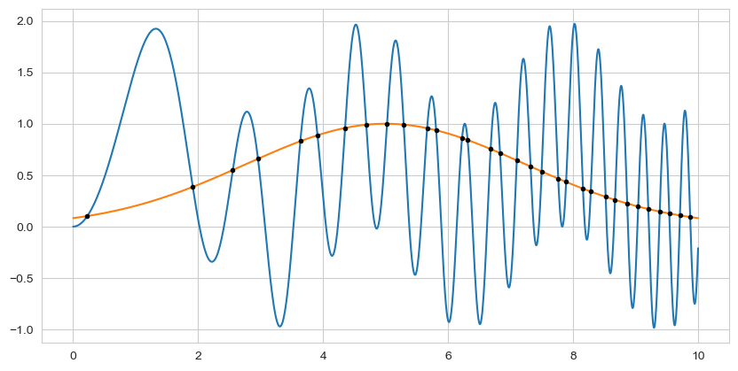

<div align="center">

# 📊 ChebPy

### *A Python implementation of Chebfun for numerical computing*

[](https://github.com/chebpy/chebpy/actions/workflows/ci.yml)
[](https://coveralls.io/github/chebpy/chebpy?branch=master)
[](https://github.com/chebpy/chebpy/actions/workflows/unittest.yml)
[](https://codespaces.new/chebpy/chebpy)

**🔬 Numerical computing with Chebyshev series approximations in Python**

*ChebPy enables symbolic-numeric computation with functions, not just numbers*

</div>

ChebPy is a Python implementation of [Chebfun](http://www.chebfun.org/), bringing the power of Chebyshev polynomial approximations to Python. It allows you to work with functions as first-class objects, performing operations like differentiation, integration, and root-finding with machine precision.
---

## Table of Contents

- [✨ Features](#-features)
- [📥 Installation](#-installation)
- [🛠️ Development](#️-development)
- [🚀 Quick Start](#-quick-start)
- [📖 Documentation](#-documentation)
- [📄 License](#-license)
- [👥 Contributing](#-contributing)

---

## ✨ Features

> **Work with functions as easily as numbers**

- 🔢 **Function Approximation**: Automatic Chebyshev polynomial approximation of smooth functions
- 📐 **Calculus Operations**: Differentiation, integration, and root-finding with machine precision
- 📊 **Plotting**: Beautiful function visualizations with matplotlib integration
- 🧮 **Arithmetic**: Add, subtract, multiply, and compose functions naturally
- 🎯 **Adaptive**: Automatically determines optimal polynomial degree for given tolerance
- 🔗 **Interoperability**: Works seamlessly with NumPy and SciPy ecosystems

---

## 📥 Installation

### Using pip (recommended)

```bash
pip install chebpy
```

### From source (development)

```bash
git clone https://github.com/chebpy/chebpy.git
cd chebpy
pip install -e .
```

> **Note**: Use `-e` flag for editable installation during development

## 🛠️ Development

> **For contributors and advanced users**

ChebPy uses modern Python development tools for a smooth developer experience:

```bash
# 📦 Install development dependencies
make install

# 🧪 Run tests with coverage
make test

# ✨ Format and lint code
make fmt
make lint

# 📓 Start interactive notebooks
make marimo

# 🔍 View test coverage report
make coverage
```

### Development Tools

- **Testing**: pytest with coverage reporting
- **Formatting**: ruff for code formatting and linting
- **Notebooks**: marimo for interactive development
- **Task Management**: Taskfile for build automation

## Quick Start

<div align="center">
  
</div>


This figure was generated with the following simple ChebPy code:

```python
import numpy as np
from chebpy import chebfun

# Create functions as chebfuns on interval [0, 10]
f = chebfun(lambda x: np.sin(x**2) + np.sin(x)**2, [0, 10])
g = chebfun(lambda x: np.exp(-(x-5)**2/10), [0, 10])

# Find intersection points
roots = (f - g).roots()

# Plot both functions and mark intersections
ax = f.plot(label='f(x) = sin(x²) + sin²(x)')
g.plot(ax=ax, label='g(x) = exp(-(x-5)²/10)')
ax.plot(roots, f(roots), 'ro', markersize=8, label='Intersections')
ax.legend()
ax.grid(True, alpha=0.3)
```

```result

```

### More Examples

```python
# Differentiation and integration
f = chebfun(lambda x: np.exp(x) * np.sin(x), [-1, 1])
df_dx = f.diff()          # Derivative
integral = f.sum()        # Definite integral

# Root finding
g = chebfun(lambda x: x**3 - 2*x - 5, [-3, 3])
roots = g.roots()         # All roots in the domain

# Function composition
# h = f + g                 # Addition
# product = f * g           # Multiplication
```

```result

```
---

## Documentation

- 📚 **[Interactive Notebooks](book/marimo/)**: Explore ChebPy features with hands-on examples
- 🎯 **[API Reference](src/chebpy/)**: Complete function and class documentation
- 🧪 **[Test Suite](tests/)**: Comprehensive examples of usage patterns
- 🚀 **[Codespaces](https://codespaces.new/chebpy/chebpy)**: Try ChebPy in your browser

---

## 📄 License

ChebPy is licensed under the **3-Clause BSD License**.

📜 See the full license in the [LICENSE.rst](LICENSE.rst) file.

---

## 👥 Contributing

**We welcome contributions!** 🎉

Whether you're fixing bugs, adding features, or improving documentation, your help makes ChebPy better for everyone.

### Quick Start for Contributors

1. 🍴 **Fork** the repository
2. 🌿 **Create** your feature branch
   ```bash
   git checkout -b feature/amazing-feature
   ```
3. ✨ **Make** your changes and add tests
4. 🧪 **Test** your changes
   ```bash
   make test
   ```
5. 📝 **Commit** your changes
   ```bash
   git commit -m 'Add amazing feature'
   ```
6. 🚀 **Push** to your branch
   ```bash
   git push origin feature/amazing-feature
   ```
7. 🎯 **Open** a Pull Request

### Resources

- 📋 [Contributing Guide](CONTRIBUTING.md)
- 🤝 [Code of Conduct](CODE_OF_CONDUCT.md)
- 🐛 [Issue Tracker](https://github.com/chebpy/chebpy/issues)

### Acknowledgments 🙏

- [Jebel-Quant/rhiza](https://github.com/Jebel-Quant/rhiza) for standardised CI/CD templates and project tooling


---

<div align="center">

**Made with ❤️ by the ChebPy community**

⭐ *If you find ChebPy useful, please consider giving it a star!* ⭐

</div>
