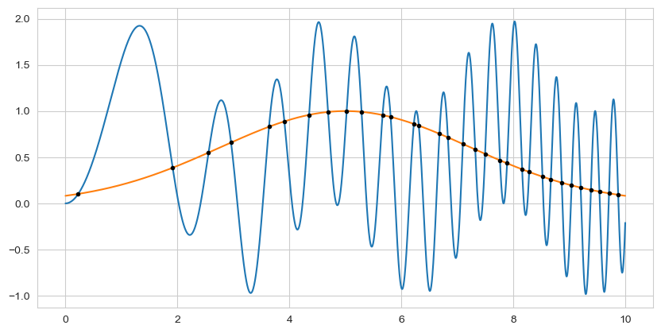

================================================
ChebPy - A Python implementation of Chebfun
================================================

.. image:: https://github.com/chebpy/chebpy/actions/workflows/unittest.yml/badge.svg
    :target: https://github.com/chebpy/chebpy/actions/workflows/unittest.yml
.. image:: https://coveralls.io/repos/github/chebpy/chebpy/badge.svg?branch=master
    :target: https://coveralls.io/github/chebpy/chebpy?branch=master
.. image:: https://img.shields.io/badge/python-%203.8_--%203.13-blue.svg?
    :target: https://github.com/chebpy/chebpy/actions/workflows/unittest.yml
.. image:: https://img.shields.io/conda/dn/conda-forge/chebfun?label=conda%20downloads
    :target: https://anaconda.org/conda-forge/chebfun
.. image:: https://img.shields.io/badge/code%20style-black-000000.svg
    :target: https://github.com/psf/black
.. image:: https://mybinder.org/badge_logo.svg
    :target: https://mybinder.org/v2/gh/chebpy/chebpy/v0.4.3?filepath=docs%2Fnotebook-getting-started.ipynb

|

Numerical computing with Chebyshev series approximations in Python.

ChebPy is a Python implementation of `Chebfun <http://www.chebfun.org/>`_.

- The software is licensed under a 3-Clause BSD License, see `LICENSE.rst <LICENSE.rst>`_.
- For installation details, see `INSTALL.rst <INSTALL.rst>`_.
- The code is documented in various files in the `docs <docs/>`_ folder.

The figure above was generated with the following simple ChebPy code:

.. code:: python

	f = chebfun(lambda x: np.sin(x**2) + np.sin(x)**2, [0, 10])
	g = chebfun(lambda x: np.exp(-(x-5)**2/10), [0, 10])
	r = (f-g).roots()
	ax = f.plot(); g.plot()
	ax.plot(r, f(r), 'o')
