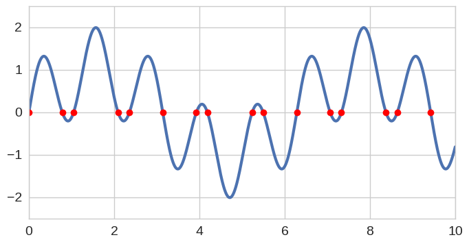
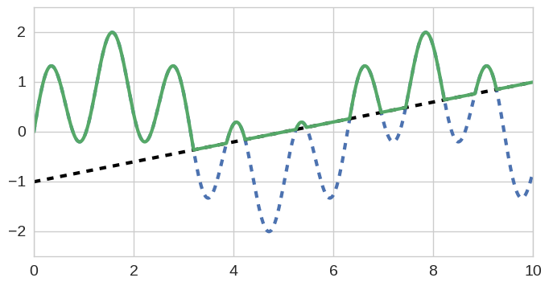
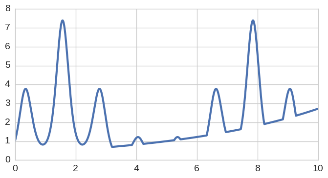
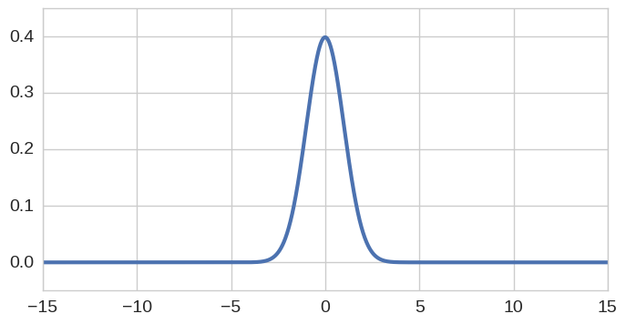

================================================
ChebPy - A Python implementation of Chebfun
================================================

.. image:: https://travis-ci.org/chebpy/chebpy.svg?branch=master
    :target: https://travis-ci.org/chebpy/chebpy
.. image:: https://coveralls.io/repos/github/chebpy/chebpy/badge.svg?branch=master
    :target: https://coveralls.io/github/chebpy/chebpy?branch=master
.. image:: https://img.shields.io/badge/python-%203.6,%203.7,%203.8-blue.svg?
    :target: https://travis-ci.org/chebpy/chebpy
.. image:: https://anaconda.org/conda-forge/chebfun/badges/installer/conda.svg
    :target: https://anaconda.org/conda-forge/chebfun

|

Chebpy is a Python implementation of `Chebfun <http://www.chebfun.org/>`_.

- For installation details, see `INSTALL.rst <INSTALL.rst>`_.
- For implementation notes, see `implementation-notes.rst <implementation-notes.rst>`_

----
Demo
----

For convenience we'll import everything from
``numpy`` and ``matplotlib``.

.. code:: python

    from numpy import *
    from matplotlib.pyplot import *
    from chebpy import chebfun

The function ``chebfun`` behaves in essentially the same way as its Matlab
counterpart. A good way to begin is to type:

.. code:: python

    x = chebfun('x', [0, 10])
    x

.. parsed-literal::

    chebfun column (1 smooth piece)
           interval       length     endpoint values
    [       0,      10]        2         0       10
    vertical scale =  10

What's happened here is we've instantiated a numerical
representation of the identity function on the interval ``[0,10]`` and
assigned this to a computer variable ``x``. This particular
representation has length 2, meaning that it is a degree one polynomial defined
via two degrees of freedom (as you would expect of a linear function).

An intuitive set of composition-like operations can now be performed. For instance
here is the specification of a function ``f`` that oscillates with two modes:

.. code:: python

    f = sin(x) + sin(5*x)
    f

.. parsed-literal::

    chebfun column (1 smooth piece)
           interval       length     endpoint values
    [       0,      10]       58  -4.4e-16    -0.81
    vertical scale =   2

The zeros of f can be computed via ``roots``, which behind the scenes is implemented via 
a recursive subdivision algorithm in which a number of Colleague Matrix eigenvalue
sub-problems are solved:

.. code:: python

    r = f.roots();
    r

.. parsed-literal::

    array([ 0.        ,  0.78539816,  1.04719755,  2.0943951 ,  2.35619449,
            3.14159265,  3.92699082,  4.1887902 ,  5.23598776,  5.49778714,
            6.28318531,  7.06858347,  7.33038286,  8.37758041,  8.6393798 ,
            9.42477796])

By default Chebpy computations are accurate to machine
precision, or approximately fifteen digits in double-precision arithmetic (see also 
`UserPrefs <https://github.com/chebpy/chebpy/blob/master/implementation-notes.rst#userprefs>`_).
We can verify this for the computed roots of ``f`` by typing:

.. code:: python

    f(r)

.. parsed-literal::

    array([ -4.44089210e-16,  -4.44089210e-16,  -2.22044605e-16,
            -4.44089210e-16,   2.77555756e-16,  -6.66133815e-16,
             3.88578059e-16,   6.66133815e-16,   2.33146835e-15,
            -4.44089210e-16,   2.10942375e-15,   6.38378239e-16,
            -3.21964677e-15,  -1.55431223e-15,  -2.30371278e-15,
             4.44089210e-15])

The function and its roots can be plotted together as follows:

.. code:: python

    f.plot();
    plot(r, f(r), 'or');

Calculus operations are natively possible with Chebfun objects. For example here is the 
derivative and indefinite integral of f:

.. code:: python

    Df = f.diff()
    If = f.cumsum()
    f.plot(); Df.plot(); If.plot()

.. image:: images/readme-diag-2.png

One can verify analytically that the exact value of the
definite integral here is:

.. code:: python

    1.2-cos(10)-.2*cos(50)

.. parsed-literal::

    1.8460783233780296

This matches our numerical integral (via Clenshaw-Curtis quadrature), which is computable
in chebpy via the ``sum`` command thus:

.. code:: python

    f.sum()

.. parsed-literal::

    1.8460783233780327

Chebfun is capable of handling certain classes of mathematical nonsmoothness.
For example, here we compute the pointwise maximum of two functions, which 
results in a 'piecewise-smooth' concatenation of twelve individual
pieces (in Chebfun & ChebPy terminology this is a collection of 'Funs').
The breakpoints between the pieces (Funs) have been determined by ChebPy in
the background by solving the corresponding root-finding problem.

.. code:: python

    g = x/5 - 1
    h = f.maximum(g)
    h

.. parsed-literal::

    chebfun column (12 smooth pieces)
           interval       length     endpoint values
    [       0,     3.2]       32  -4.4e-16    -0.36
    [     3.2,     3.9]        2     -0.36    -0.23
    [     3.9,     4.2]       14     -0.23    -0.15
    [     4.2,     5.3]        2     -0.15    0.051
    [     5.3,     5.5]       12     0.051    0.092
    [     5.5,     6.3]        2     0.092     0.27
    [     6.3,       7]       17      0.27     0.39
    [       7,     7.5]        2      0.39     0.49
    [     7.5,     8.2]       17      0.49     0.65
    [     8.2,     8.8]        2      0.65     0.77
    [     8.8,     9.3]       15      0.77     0.85
    [     9.3,      10]        2      0.85        1
    vertical scale =   2    total length = 119

Here's a plot of both ``f`` and ``g``, and their
maximum, ``h``:

.. code:: python

    f.plot(linewidth=1, linestyle='--')
    g.plot(linewidth=1, linestyle='--')
    h.plot()
    ylim([-2.5, 2.5]);

The function ``h`` is a further Chebfun representation (Chebfun operations
such as this are closures) and thus the same set of operations
can be applied as normal. Here for instance is the exponential of ``h`` and its integral:

.. code:: python

    exp(h).plot();

.. code:: python

    exp(h).sum()

.. parsed-literal::

    22.090079782676828

Here's a further example, this time related to statistics. We consider
the following Chebfun representation of the standardised Gaussian
distribution, using a sufficiently wide interval as to facilitate a
machine-precision representation. On this occasion we utlilise a slightly
different (but still perfectly valid) approach to construction whereby we
supply the function handle (in this case, a Python lambda, but more
generally any object in possession of a ``__call__`` attribute) together
with the interval of definition.

.. code:: python

    gaussian = lambda x: 1/sqrt(2*pi) * exp(-.5*x**2)
    pdf = chebfun(gaussian, [-15, 15])
    pdf.plot()
    ylim([-.05, .45]);
    title('Standard Gaussian distribution (mean  0, variance 1)');

The integral of any probability density function should be 1, and this
is the case for our numerical approximation:

.. code:: python

    pdf.sum()

.. parsed-literal::

    0.99999999999999978

Suppose we wish to generate quantiles of the distribution. This can be
achieved as follows. First we form the cumulative distribution function,
computed as the indefinite integral (``cumsum``) of the density:

.. code:: python

    cdf = pdf.cumsum()
    cdf.plot()
    ylim([-0.1, 1.1]);

.. image:: images/readme-diag-6.png

Then it is simply a case of utilising the ``roots`` command
to determine the standardised score (sometimes known as "z-score")
corresponding to the quantile of interest. For example:

.. code:: python

    print 'quantile    z-score '
    print '--------------------'
    for quantile in arange(.1, .0, -.01):
        print '  {:2.0f}%       {:+5.3f}'.format(1e2*quantile, (cdf-quantile).roots()[0])

.. parsed-literal::

    quantile    z-score 
    --------------------
      10%       -1.282
       9%       -1.341
       8%       -1.405
       7%       -1.476
       6%       -1.555
       5%       -1.645
       4%       -1.751
       3%       -1.881
       2%       -2.054
       1%       -2.326

Other distributional properties are also computable. Here's how we can
compute the first four normalised and centralised moments (Mean, Variance,
Skew, Kurtosis):

.. code:: python

    x = pdf.x
    m1 = (pdf*x).sum()
    m2 = (pdf*(x-m1)**2).sum()
    m3 = (pdf*(x-m1)**3).sum() / m2**1.5
    m4 = (pdf*(x-m1)**4).sum() / m2**2
    print '    mean = {:+.4f}'.format(m1)
    print 'variance = {:+.4f}'.format(m2)
    print '    skew = {:+.4f}'.format(m3)
    print 'kurtosis = {:+.4f}'.format(m4)

.. parsed-literal::

        mean = -0.0000
    variance = +1.0000
        skew = -0.0000
    kurtosis = +3.0000

