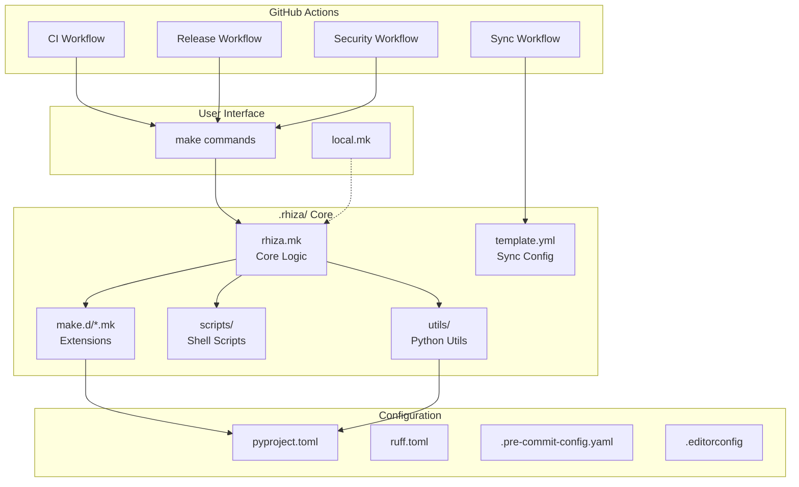
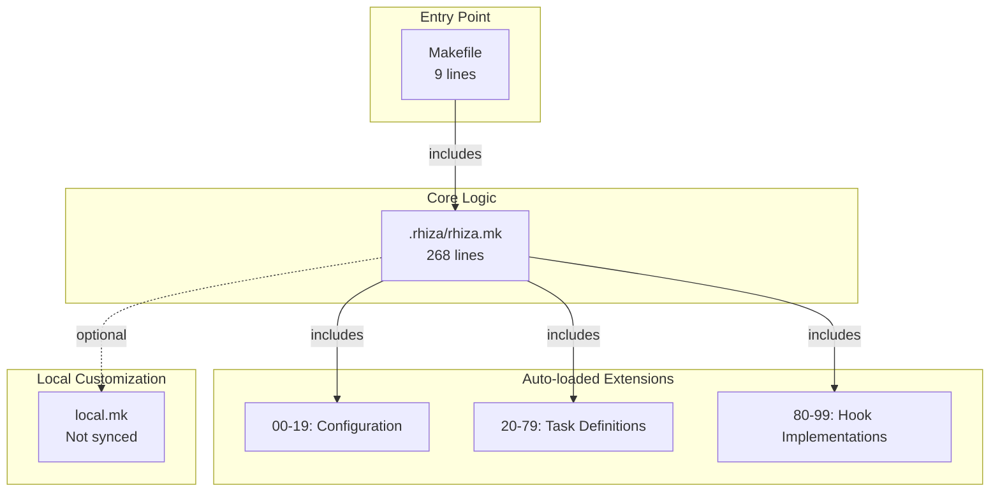
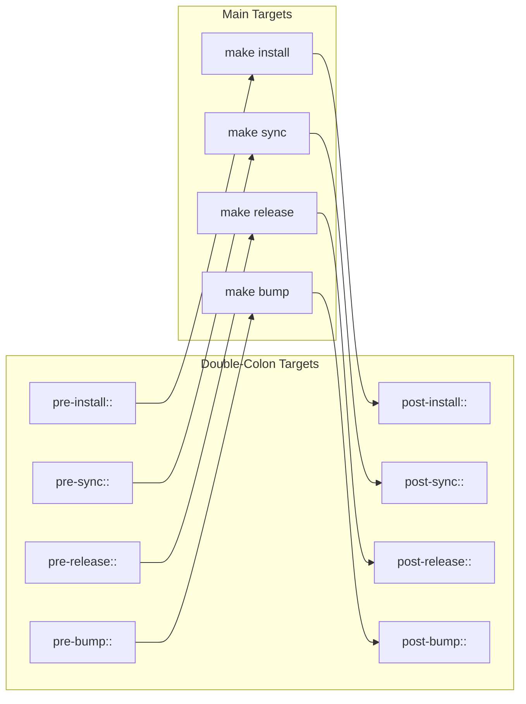
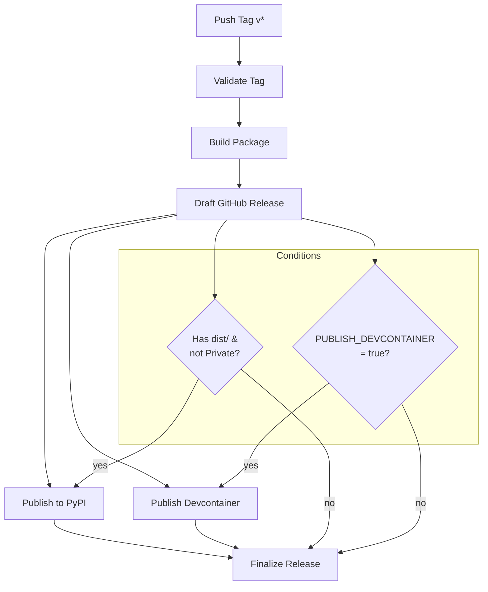
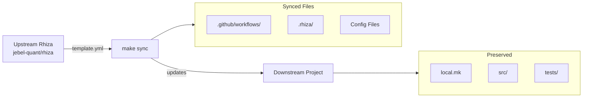
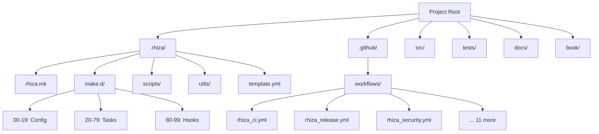
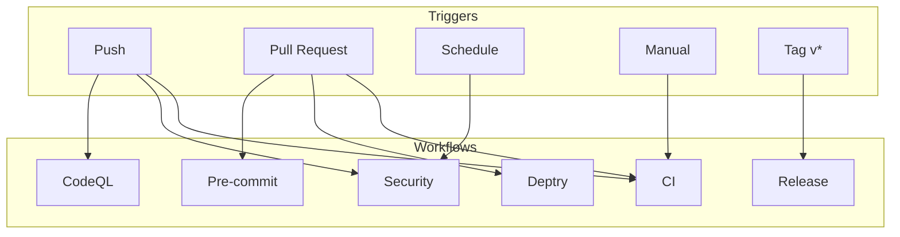
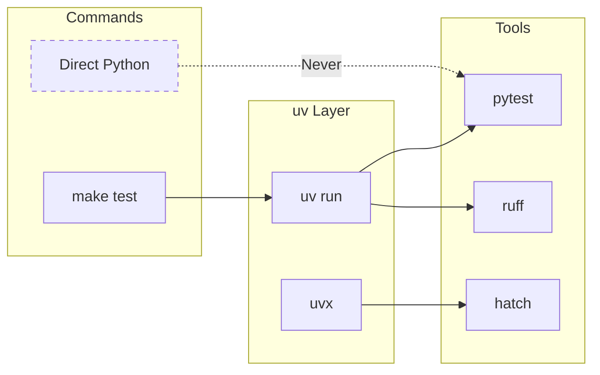

# Rhiza Architecture

Visual diagrams of Rhiza's architecture and component interactions.

## System Overview

## Makefile Hierarchy

## Hook System

## Release Pipeline

## Template Sync Flow

## Directory Structure

## CI/CD Workflow Triggers

## Python Execution Model

