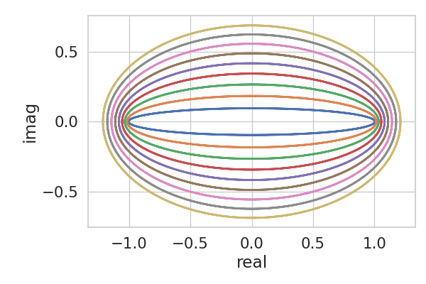
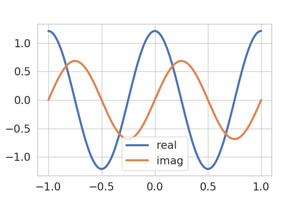
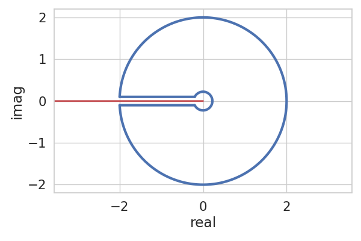

----
Complex chebfuns
----

As of v0.4.0 ChebPy supports complex variable representations. This makes it extremely convenient to perform certain computations in the complex plane.

For example here is how we can plot a series of "Bernstein ellipses" - important objects in the convergence theory of Chebyshev series approximations for analytic functions. They are computed as transformations of the scaled complex unit circle under the Joukowsky map:

.. code:: python

    x = chebfun('x', [-1, 1])
    z = np.exp(2*np.pi*1j*x)
    joukowsky = lambda z: .5*(z+1/z)
    for rho in np.arange(1.1, 2, 0.1):
        ellipse = joukowsky(rho*z)
        ellipse.plot(linewidth=2)

Per the first line of the above code segment, each of these ellipses is a complex-valued function of the real variable ``x`` defined on ``[-1, 1]``. It is trivial to extract the real and imaginary components and plot these on the ``x`` domain, which we do for the last (largest) ellipse in the sequence as follows:

.. code:: python

    fig, ax = plt.subplots()
    ellipse.real().plot(linewidth=3)
    ellipse.imag().plot(linewidth=3)
    ax.legend(['real', 'imag'])

Here is an example of using ChebPy to perform a contour integral calculation (replicating Trefethen & Hale's `example <https://www.chebfun.org/examples/complex/KeyholeContour.html>`_):

.. code:: python

    # set up the keyhole contour
    r, R, e = 0.2, 2, 0.1
    v = [-R+e*1j, -r+e*1j, -r-e*1j, -R-e*1j]
    s = chebfun('x', [0, 1])         # dummy variable
    z0 = v[0] + (v[1]-v[0])*s        # top of the keyhole
    z1 = v[1] * v[2]**s / v[1]**s    # inner circle
    z2 = v[2] + s * (v[3]-v[2])      # bottom of keyhole
    z3 = v[3] * v[0]**s / v[3]**s    # outer circle

    # plot the keyhole contour
    fig, ax = plt.subplots()
    kwds = dict(color='b', linewidth=3)
    z0.plot(ax=ax, **kwds)
    z1.plot(ax=ax, **kwds)
    z2.plot(ax=ax, **kwds)
    z3.plot(ax=ax, **kwds)

    # plot the branch cut
    ax.plot([-4, 0], [0, 0], color='r', linewidth=2, linestyle='-')
  
    ax.axis('equal');
    ax.set_xlim([-2.2, 2.2])

We then perform the numerical integration as follows:

.. code:: python

    f = lambda x: np.log(x) * np.tanh(x)
    def contour_integral(z, f):
        I = f(z) * z.diff()
        return I.sum()

    y0 = np.sum([contour_integral(z, f) for z in (z0, z1, z2, z3)])    # numerical integral
    y1 = 4j * np.pi * np.log(np.pi/2)                                  # exact value

As usual, this yields a high-accuracy result:

.. code:: python
    
    print('   y0 = {:+.15f}\n'.format(y0)+\
          '   y1 = {:+.15f}\n'.format(y1)+\
          'y1-y0 = {:+.15f}'.format(y1-y0))

.. code:: python
 
       y0 = +0.000000000000003+5.674755637702217j
       y1 = +0.000000000000000+5.674755637702224j
    y1-y0 = -0.000000000000003+0.000000000000006j
