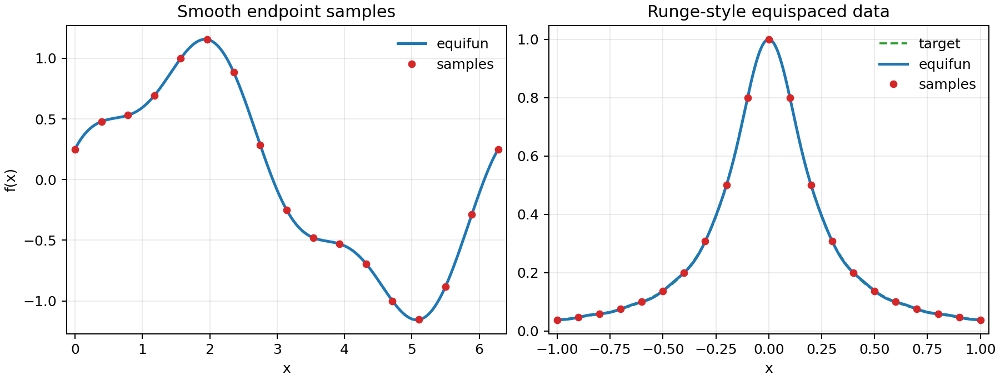

# Function Approximation

ChebPy automatically approximates smooth functions with Chebyshev polynomials to
machine precision.

## Adaptive Construction

Pass any callable to `chebfun` and ChebPy determines the optimal polynomial degree:

```python
import numpy as np
from chebpy import chebfun

f = chebfun(lambda x: np.exp(np.sin(x)), [-5, 5])
print(len(f))  # polynomial degree chosen automatically
```

## Fixed-Length Construction

Specify the number of points explicitly with the `n` parameter:

```python
f = chebfun(lambda x: np.sin(x), [-np.pi, np.pi], n=32)
```

## Equispaced Sample Data

Use `equifun` when you already have one-dimensional values sampled on an
equispaced grid that includes both interval endpoints:

```python
import matplotlib.pyplot as plt
import numpy as np
from chebpy import equifun

nodes = np.linspace(0.0, 2.0 * np.pi, 17)
values = np.sin(nodes) + 0.25 * np.cos(3.0 * nodes)
f = equifun(values, [0.0, 2.0 * np.pi])

xx = np.linspace(0.0, 2.0 * np.pi, 500)
plt.plot(xx, f(xx), label="equifun")
plt.plot(nodes, values, "o", label="samples")
plt.legend()
plt.savefig("docs/assets/equifun-examples.png", dpi=180)
```

For equispaced data, ChebPy first builds a Floater-Hormann rational interpolant
through the samples and then adaptively represents it as a Chebfun. This is often
more stable than high-degree polynomial interpolation on equispaced nodes,
including Runge-style data:



## Special Constructors

```python
# Identity function
x = chebfun('x')

# Constant function
c = chebfun(3.14)

# Piecewise-constant function
from chebpy import pwc
f = pwc(domain=[-2, -1, 0, 1, 2], values=[-1, 0, 1, 2])
```

## Multi-Interval Functions

ChebPy can represent functions with breakpoints as piecewise Chebyshev expansions:

```python
f = chebfun(lambda x: np.abs(x), [-1, 0, 1])
```

## Chebyshev Points

Use `chebpts` to get the Chebyshev interpolation points and barycentric weights:

```python
from chebpy import chebpts

pts, wts = chebpts(16)              # 16 points on [-1, 1]
pts, wts = chebpts(16, [0, 3])      # 16 points on [0, 3]
```

## References

- Z. Battles and L. N. Trefethen,
  [*An extension of MATLAB to continuous functions and operators*](https://epubs.siam.org/doi/10.1137/S1064827503430126),
  SIAM J. Sci. Comput., 25 (2004), pp. 1743–1770.
- L. N. Trefethen, *Approximation Theory and Approximation Practice*,
  SIAM, 2013 (extended edition 2019).
- J. L. Aurentz and L. N. Trefethen,
  [*Chopping a Chebyshev series*](https://dl.acm.org/doi/10.1145/2998442),
  ACM Trans. Math. Softw., 43 (2017), Article 33.
- R. Pachón, R. B. Platte, and L. N. Trefethen,
  [*Piecewise-smooth chebfuns*](https://academic.oup.com/imajna/article/30/4/898/659725),
  IMA J. Numer. Anal., 30 (2010), pp. 898–916.
