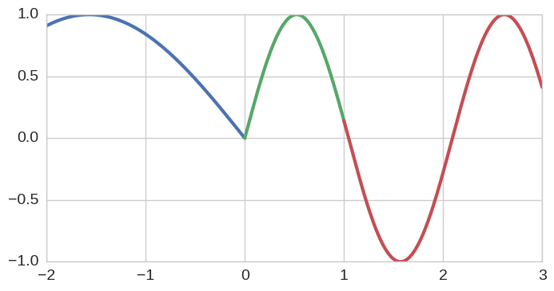
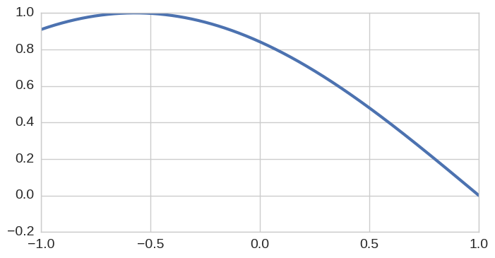

Chebpy: Implementation Notes
---------------------------

The internals of Chebpy have been designed to resemble the
design structure of Matlab Chebfun. The Chebfun v5 class diagram thus
provides a useful map for understanding how the various pieces of Chebpy
fit together (diagram courtesy of the Chebfun team, via
https://github.com/chebfun/chebfun/wiki/Class-diagram):

.. image:: images/implementation-notes-chebfun-v5-class-diag.png

At this stage, only a relatively small subset of Matlab Chebfun has been
implemented in Chebpy. In the class diagram above, this consists of all
the classes traced by the path going up from from ``Chebtech2`` (green box
in the bottom right), to ``Chebfun`` (blue box near the top-left). More
explicitly, the following classes currently exist in Chebpy:

-  ``Chebfun`` (core/chebfun.py)
-  ``Fun`` (core/fun.py)
-  ``Classicfun`` (core/classicfun.py)
-  ``Bndfun`` (core/bndfun.py)
-  ``Onefun`` (core/onefun.py)
-  ``Smoothfun`` (core/smoothfun.py)
-  ``Chebtech`` (core/chebtech.py)
-  ``Chebtech2`` (core/chebtech.py)

Chebpy additionally provides the following classes which do not appear
in their present form in Matlab Chebfun:

-  ``Interval`` (core/utilities.py)
-  ``Domain`` (core/utilities.py)

Chebpy allows the user to override some default preferences, similar to 
what is available through ``chebfunpref`` in ``Chebfun`` (bottom right).
Not all options are the same, and chebpy allows additional customisation
not found in ``Chebfun``.

-  ``UserPrefs`` (core/settings.py)

The general rule is that each Chebpy class lives in its own python file.

One can explore the organisation of the library in practice as follows.
We describe the three core components with reference to the colours in
the above class diagram.

Chebfun (blue)
~~~~~~~~~~~~~~

.. code:: python

    from numpy import *
    from chebpy import chebfun

We'll start by creating an identity chebfun on an arbitrary non-unit
interval:

.. code:: python

    x = chebfun('x', [-2, 3])
    x

.. parsed-literal::

    chebfun column (1 smooth piece)
           interval       length     endpoint values
    [      -2,       3]        2        -2        3
    vertical scale =   3

This variable is an object of class ``Chebfun``:

.. code:: python

    type(x)

.. parsed-literal::

    chebpy.core.chebfun.Chebfun

Fun (yellow)
~~~~~~~~~~~~

Conceptually, ``Chebfun`` objects are defined as a collection (numpy
array) of Fun objects. One can access these via the ``.funs``
attribute, and in this example, since our function is globally smooth,
our chebfun is composed of single Fun:

.. code:: python

    x.funs

.. parsed-literal::

    array([Bndfun([-2.0, 3.0], 2)], dtype=object)

Fun is an abstract class, so we don't actually see Fun objects per-se,
but rather objects further down the inheritance tree. Specifically, we
see objects of type ``BndFun``, denoting a function defined on
a bounded interval.

Here's a more interesting function, this time composed of two ``Fun``
objects and created by inducing a discontinuity via use of the
maximum operator:

.. code:: python

    f = sin(3*x).maximum(-sin(x))
    f

.. parsed-literal::

    chebfun column (2 smooth pieces)
           interval       length     endpoint values
    [      -2,-2.2e-16]       20      0.91 -5.6e-17
    [-2.2e-16,       3]       31  -4.4e-16     0.41
    vertical scale =   1    total length = 51

.. code:: python

    f.funs

.. parsed-literal::

    array([Bndfun([-2.0, -2.22044604925e-16], 20),
           Bndfun([-2.22044604925e-16, 3.0], 31)], dtype=object)

The core ``Chebfun`` class constructor accepts iterable collections of
``Fun`` objects, and the above chebfun can be recreated as follows:

.. code:: python

    from chebpy.core.chebfun import Chebfun
    Chebfun(f.funs)

.. parsed-literal::

    chebfun column (2 smooth pieces)
           interval       length     endpoint values
    [      -2,-2.2e-16]       20      0.91 -5.6e-17
    [-2.2e-16,       3]       31  -4.4e-16     0.41
    vertical scale =   1    total length = 51

The Fun objects defining a chebfun must provide a non-overlapping and
complete partition of the global approximation interval. Chebpy-specific
exceptions will be raised if the user/developer does not properly
account for this.

To see this, let's break the second Fun into two sub-pieces (using
``fun.restrict``) and attempt various reconstruction
permutations.

.. code:: python

    from chebpy.core.utilities import Interval
    _, a, c = f.breakpoints
    b = 1
    fun0 = f.funs[0]
    fun1 = f.funs[1].restrict(Interval(a,b))
    fun2 = f.funs[1].restrict(Interval(b,c))
    fun0.plot(linewidth=3); fun1.plot(linewidth=3); fun2.plot(linewidth=3);

So, the following works:

.. code:: python

    Chebfun([fun0,fun1,fun2])

.. parsed-literal::

    chebfun column (3 smooth pieces)
           interval       length     endpoint values
    [      -2,-2.2e-16]       20      0.91 -5.6e-17
    [-2.2e-16,       1]       31  -1.7e-16     0.14
    [       1,       3]       31      0.14     0.41
    vertical scale =   1    total length = 82

But on the other other hand, the following raises an exception:

.. code:: python

    Chebfun([fun0,fun2])

::

    /chebpy/chebpy/core/utilities.pyc in _sortindex(intervals)
        198         raise IntervalOverlap
        199     if (d>0).any():
    --> 200         raise IntervalGap
        201 
        202     return idx

    IntervalGap: The supplied Interval objects do not form a complete partition of the approximation interval

So also does this:

.. code:: python

    Chebfun([fun0,f.funs[1],fun1])

::

    /chebpy/chebpy/core/utilities.pyc in _sortindex(intervals)
        196     d = x[1::2] - x[::2]
        197     if (d<0).any():
    --> 198         raise IntervalOverlap
        199     if (d>0).any():
        200         raise IntervalGap

    IntervalOverlap: The supplied Interval objects overlap

Onefun (green)
~~~~~~~~~~~~~~

A Fun object is defined by the composition of ``Onefun`` object and an
Interval object. A ``Onefun`` object in Chebpy, as with Matlab Chebfun,
define a set of core approximation behaviour on the unit interval
[-1,1]. The computational mechanics of mapping these operations
to arbitrary intervals [a,b] is managed, in part, by the a
corresponding Interval object.

To illustrate, let's take the first component ``Fun`` from earlier
(which was specifically a ``Bndfun``):

.. code:: python

    f.funs[0]

.. parsed-literal::

    Bndfun([-2.0, -2.22044604925e-16], 20)

The Onefun and Interval object components are accessed as follows:

.. code:: python

    print f.funs[0].onefun

.. parsed-literal::

    <Chebtech2{20}>

.. code:: python

    print f.funs[0].interval

.. parsed-literal::

    [ -2.00000000e+00  -2.22044605e-16]

``Onefun`` is an abstract class, so what we actually see instantiated is an
object of type Chebtech2. To see that the ``Onefun`` object is what is
claims to be (a representation defined on the unit-interval), we can
plot it (users will rarely do this in practice, but this can
nevertheless be a useful feature for developers):

.. code:: python

    f.funs[0].onefun.plot(linewidth=3);

So while the ``Onefun`` attribute determines approximation behaviour, the
interval attribute manages the mapping to and from the approximation
interval to [-1,1]. So for instance, one can evaluate the
interval object at some set of points in [-1,1] and obtain these
values mapped to [a,b]:

.. code:: python

    f.funs[0].interval(linspace(-1,1,11))

.. parsed-literal::

    array([ -2.00000000e+00,  -1.80000000e+00,  -1.60000000e+00,
            -1.40000000e+00,  -1.20000000e+00,  -1.00000000e+00,
            -8.00000000e-01,  -6.00000000e-01,  -4.00000000e-01,
            -2.00000000e-01,  -2.22044605e-16])

UserPrefs
~~~~~~~~~~~~~~

The user may want to specify different tolerances, for example if speed is important
or the function under consideration is particularly difficult. It is also possible to
change default behaviour like plotting.

.. code:: python

    import matplotlib.pyplot as plt
    import chebpy
    chebpy.core.settings.userPrefs.eps = 1e-10  # lower the tolerance in chebpy
    cheb = chebpy.chebfun(lambda x: x**2)
    chebpy.core.settings.userPrefs.N_plot = 21  # use fewer points for plotting
    cheb.plot(marker='x', label='few points')
    chebpy.core.settings.userPrefs.reset('N_plot')  # restore default
    cheb.plot(label='many points')
    plt.show()

